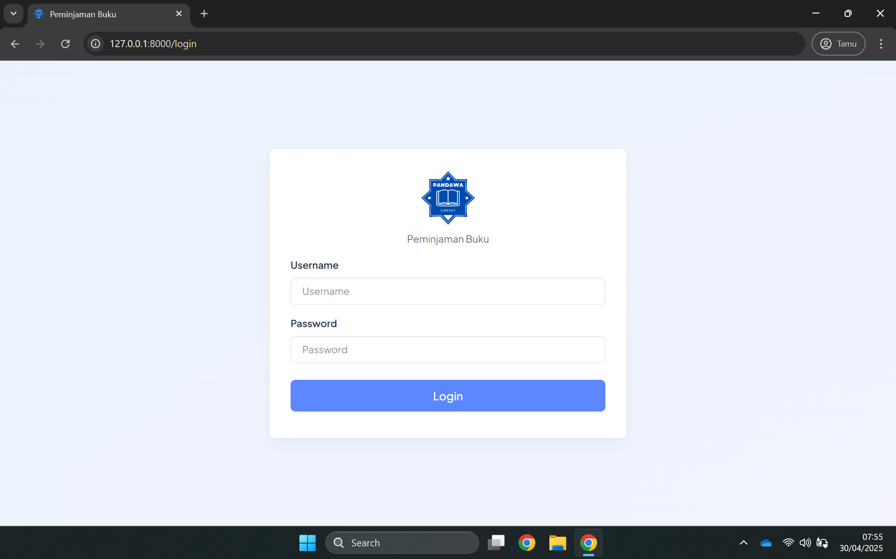
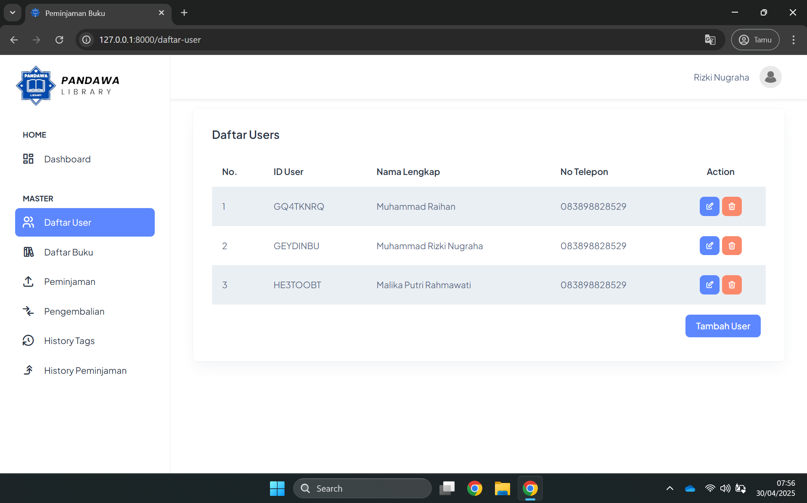
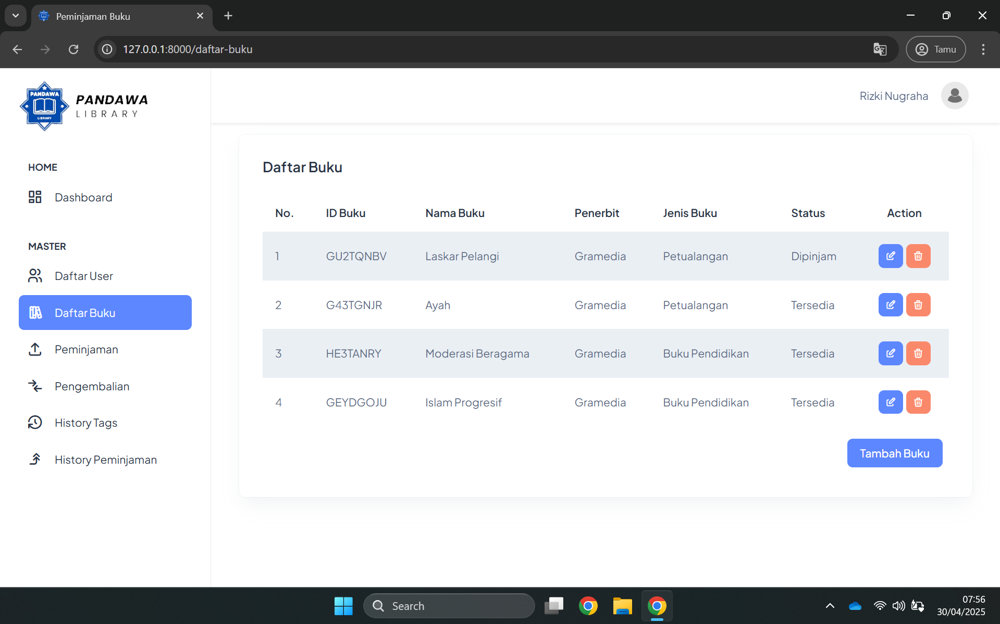
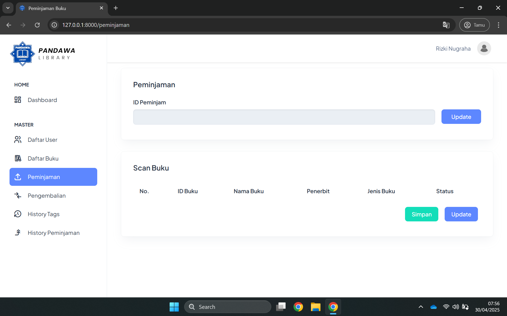
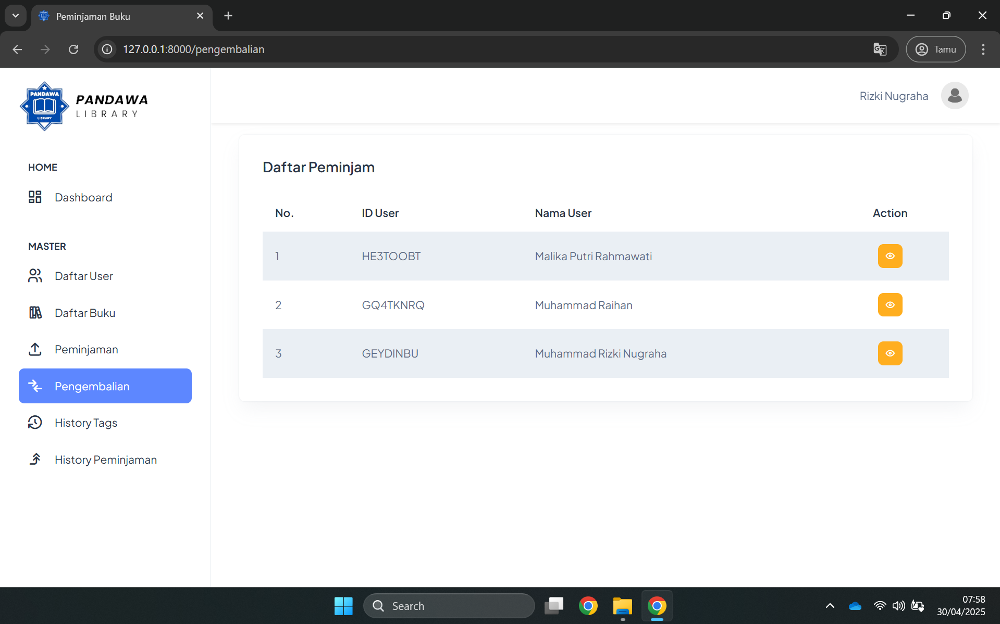
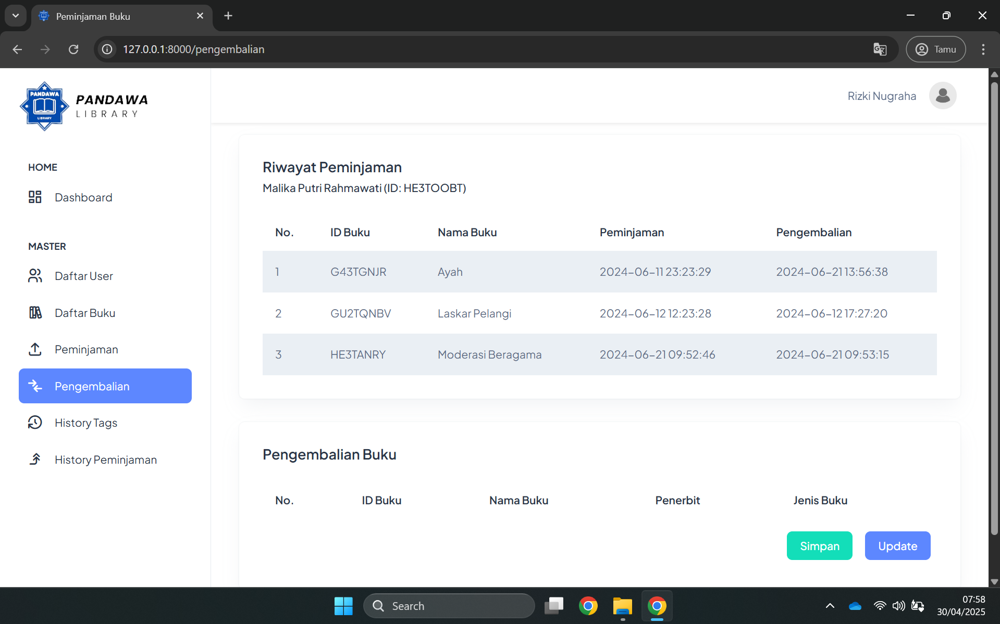
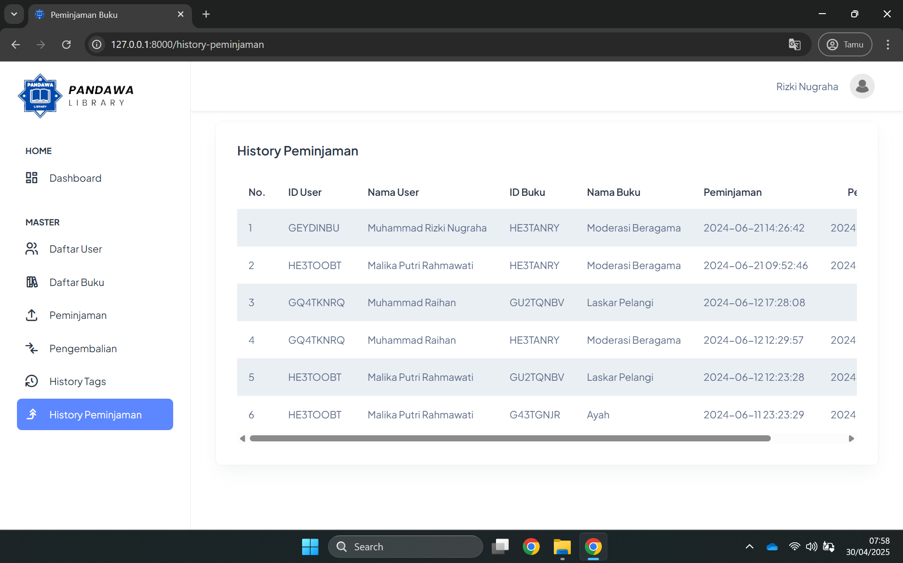
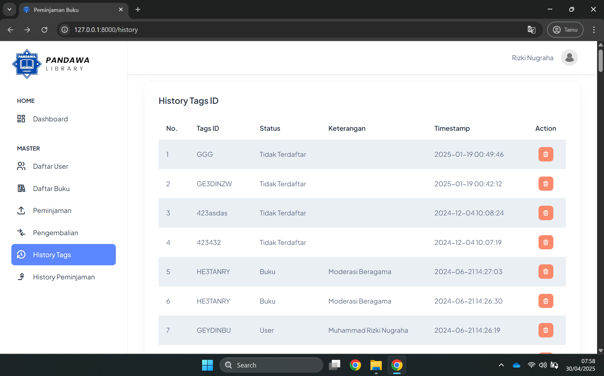
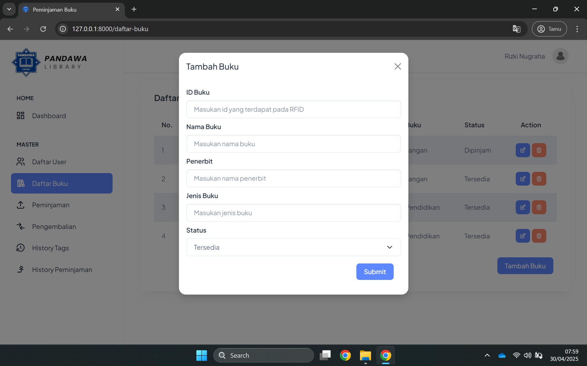
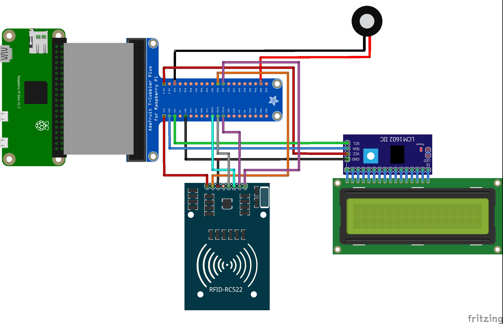

# 📚 IoT Book Borrowing System 🤖

## 📋 Project Overview
This project is an automated book borrowing system that leverages Internet of Things (IoT) technology to streamline the process of borrowing and returning books. Built as a final project for an Internet of Things course, this system utilizes Raspberry Pi as the main controller alongside RFID sensors to identify books and users without manual input.

The traditional book borrowing process is often time-consuming, requiring staff assistance and manual data entry which can lead to errors and inefficiencies. This automated system was developed to increases borrowing efficiency, reduces administrative workload, provides real-time tracking of book, and improves the overall user experience in libraries or educational institutions.

## ✨ Key Features
- **RFID-Based Identification**: Contactless scanning of books and user IDs
- **Automated Borrowing Process**: Self-service book checkout without staff intervention
- **Real-Time Data Processing**: Instant recording of book borrowing and returns
- **User Authentication**: Secure login system with role-based access
- **Book Management**: Comprehensive database of all available books
- **Borrowing Records**: Tracking of all current and past book loans
- **Return Management**: Automated processing of book returns
- **Sensor Reading History**: Logs of sensor interactions for system monitoring
- **Web Interface**: User-friendly dashboard for both users and administrators
- **RESTful API**: Backend architecture for communication between hardware and software

## 🖼️ Preview

### Login Screen

### Dashboard

### User Management

### Book Inventory

### Borrowing Management

### Return Management

### Return Details

### Borrowing History

### Sensor Reading History

### Data Entry Form

### Wiring Diagram

### Complete Mockup
[View Full Figma Mockup](https://drive.google.com/file/d/1_LcMYifSr5sVfYnO2sBgnOnXvg98nNlK/view?usp=sharing)

### Raspberry Pi Code
[View Raspberry Pi Code Program](https://github.com/rizkingrh/Arduino/tree/main/Raspberry%20Pi%20Code)

## 🛠️ Technologies

### Hardware 🔌
- **Raspberry Pi**: Main controller for the IoT system
- **RFID Reader/Writer**: For scanning book tags and user IDs
- **RFID Sticker Tags**: Attached to books for identification
- **LED indicators**: Visual feedback for successful/failed operations
- **LCD Display**: To inform scan details in text
- **Buzzer**: Audio feedback for system operations

### Software 💻
- **Frontend**:
  - Laravel Blade, JavaScript
  - Bootstrap for responsive design
  - Figma for UI/UX design and prototyping

- **Backend** 🔧:
  - Laravel PHP Framework
  - RESTful API architecture
  - Authentication middleware

- **Database** 💾:
  - MySQL
  - MySQL Workbench for database design

- **IoT Programming**:
  - Python for Raspberry Pi
  - HTTP requests for API communication

## 🚀 System Architecture

The Book Borrowing System is structured into three main components:

1. **Hardware Layer**: 
   - Raspberry Pi connected to RFID sensors
   - Physical interface for book scanning
   - LCD Display for display text
   - LED/Buzzer feedback mechanisms

2. **Communication Layer**:
   - RESTful API for data transmission
   - Secure authentication for API access
   - Real-time data synchronization

3. **Application Layer**:
   - Web interface for users and administrators
   - Database for storing book and user information
   - Business logic for handling borrowing rules

## 🔄 How It Works

1. A user approaches the borrowing station with their ID card and books
2. They scan their RFID-enabled ID card for authentication
3. Upon successful authentication, they scan the books they wish to borrow
4. The Raspberry Pi reads the RFID tags and sends the data to the server via API
5. The system processes the request, updates the database, and sends confirmation
6. The user receives visual and audio feedback confirming successful borrowing
7. For returns, the process is similar, with books being scanned and marked as returned in the system

## 🚀 Future Improvements
- **Fine Integration**: Automatic calculation and notification of overdue fines
- **Book Recommendation System**: AI-based recommendations based on borrowing history
- **Mobile Application**: Companion app for iOS and Android
- **SMS/Email Notifications**: Alerts for due dates and confirmations
- **Multiple Station Support**: Scaling to support multiple borrowing stations
- **Integration with Library Catalog Systems**: Connecting with existing library infrastructure
- **Advanced Analytics**: Usage patterns and popular book tracking
- **Facial Recognition**: Additional authentication layer for enhanced security
